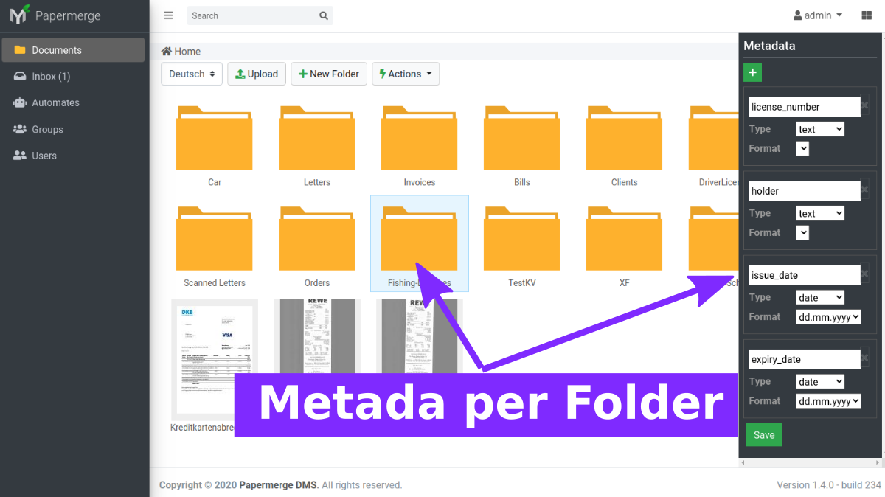
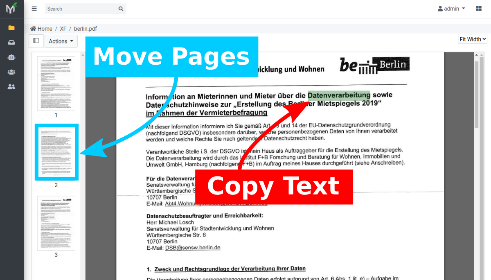
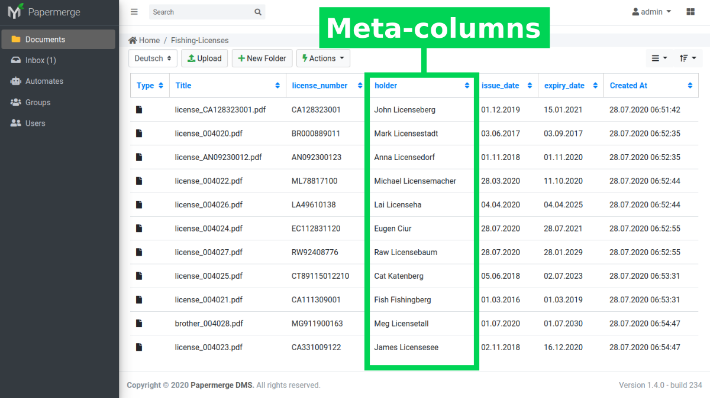

# Papermerge - Document Management System

Papermerge is an open source document management system (DMS) primarily
designed for archiving and retrieving your digital documents. Instead of
having piles of paper documents all over your desk, office or drawers - you
can quickly scan them and configure your scanner to directly upload to
Papermerge DMS.

Papermerge DMS on its turn will
[OCR](https://en.wikipedia.org/wiki/Optical_character_recognition) the
document and index it. You will be able to quickly find any (scanned!)
document using full text search capabilities.

It is built on [Django 3.0](https://www.djangoproject.com/).

Papermerge is actively developed and I [release quite frequently](https://github.com/ciur/papermerge/releases).

This is web-based software. This means there is no executable file (aka no
.exe files), and it must be run on a web server and accessed through a web
browser.

## Right Tool For You?

To be efficient you always need to choose right tool for the problem. Because
*Document Management* is too generic - I think that a definition of what is a
*Document* in context of this software is needed.

For Papermerge a document is anything which is a good candidate for archiving - some piece of information which is not editable but you need to store it for
future reference. For example receipts are perfect examples - you don't need to
read receipts everyday, but eventually you will need them for your tax
declaration. In this sense - scanned documents, which are usually
in PDF or TIFF format, are perfect match.

Out of scope (at least for near future) are Office documents (ODT, DOCX....),
text files (notes) which usually are editable. In future Papermerge might support Office documents (ODT etc), but that feature will be provided as plugins.

Papermerge is simply not designed to store books. Yes, you can scan a book and import it in Papermege, but again - this is not what Papermerge was designed for.

## Features
    
* Documents of pdf, jpg, png, tiff formats are supported
* Per page OCR of the documents
* Full Text Search of the scanned documents
* Files and Folders - users can organize documents in folders
* Multi-User
* User permissions management
* Document permissions management
* REST API ([screencast demo](https://vimeo.com/391436134))
* Page Management - delete, reorder, cut & paste pages ([screencast demo](https://www.youtube.com/watch?v=CRhUpPqCI64))

## Resources

 * [Video Demo](https://www.youtube.com/watch?v=U_x8fOhuMTI)
 * [Documentation](https://papermerge.readthedocs.io/)
 * [English Website](https://papermerge.com)
 * [German Website](https://papermerge.de)

## Screenshots

### Try it!

You can try it with just 3 simple commands (you need git and docker-compose):

    git clone git@github.com:ciur/papermerge.git
    cd docker
    docker-compose up -d

Docker compose command will pull all necessary docker images and start
papermerge (stable 1.2 version) on http://localhost:8000. Access it with
default username/password: admin/admin.

### Installation

There are couple options:
    
* [From docker container](https://papermerge.readthedocs.io/en/latest/setup/docker.html)
* [Using systemd](https://papermerge.readthedocs.io/en/latest/setup/systemd.html)
* [Manual way - detailed step by step instructions](https://papermerge.readthedocs.io/en/latest/setup/manual_way.html)
* Deploy it with ansible... coming soon!

### Comparison With Other DMS

From my own reasearch I found another two very similar projects - [Paperless](https://github.com/the-paperless-project/paperless) and [MayanEDMS](https://www.mayan-edms.com/). Similar to the way parents tend to love their own children more - I am biased towards my own project - Papermerge. So, below is a comparison table of the three based on my research.

|  Metric  | Papermerge | [MayanEDMS](https://www.mayan-edms.com/) | [Paperless](https://github.com/the-paperless-project/paperless)         
|----------|:-----------:|:---------------------------------------:|:---------------:|
|OCR   | Yes | Yes | Yes |
|Metadata |  Yes (> 1.3.0) | Yes | No |
|Folders/Cabinets| Yes (Folders) | Yes (Cabinets) | No |
|Advanced Permissions Management | Yes | Yes | No |
|Documents Versioning| No | Yes | No | 
|Digital Signatures | No | Yes | No |
|Workflows| No | Yes | No |
|Tags     | No | Yes | Yes |
|REST API | Yes | Yes | Yes |
|License  | Apache-2.0 | Apache 2.0 | GPLv3 |
|Status| Active Development | Active Development | Maintenance / No Development| 
|Stable Release | 1.2.2 / May 16, 2020 | 3.4.7 / April 28, 2020 | 2.7.0 / January 27, 2019 |
|Initial Release| February 9, 2020 | February 3, 2011 | ~ 2015 |
|Python3?| Yes | Yes | Yes|
|Django Version| 3.0 | 2.2 | 2.0|

### Contact 

* [Twitter Account](https://twitter.com/papermerge)
* [YouTube Channel](https://www.youtube.com/channel/UC8KjEsDexEERBw_-VyDbWDg)
* [EMail](mailto:eugen@papermerge.com)

